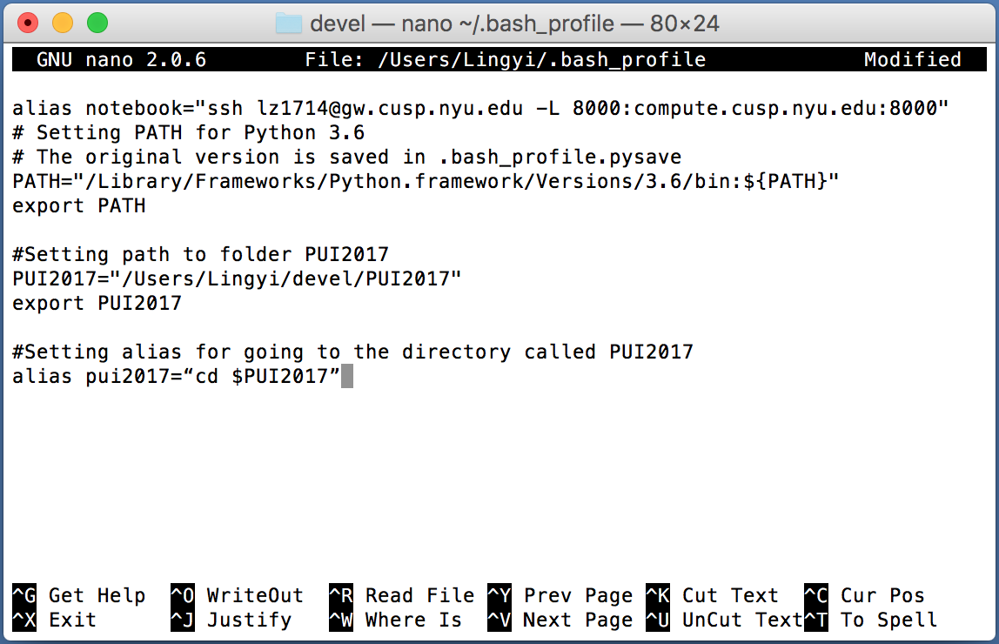
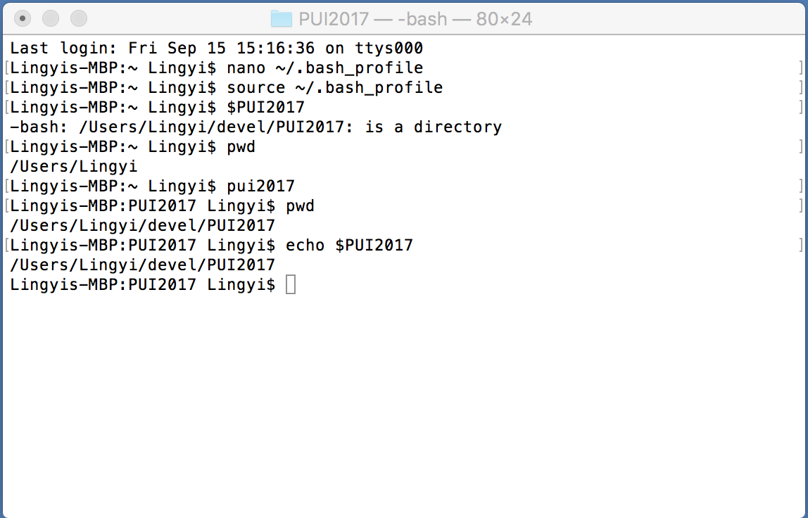

# This is a markdown file to describe what I did to set up my environment as derected by the HW1_2_instructions.

creat a directory named PUI2017 on my computer
```
mkdir PUI2017
```

creat an environmental variable and the alias for going there
```
PUI2017="/Users/Lingyi/devel/PUI2017"
export PUI2017

alias pui2017="cd $PUI2017"
```
You can see the alias and env. variable as follow


Rerun to modify my setting
```
source ~/.bash_profile
```

Type the following commands to check the output
```
pwd
pui2017
pwd
```
This is the output in my computer



